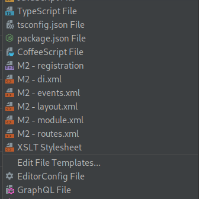

# PHP Storm - Magento

- [x] File templates to easily create Magento files (i.e.: layout.xml, registration.php):

## Include file templates into your PHP Storm

`cp -R config/fileTemplates ~/.PHP_STORM_FOLDER/config`

## 10.Configurações do Xdebug no PhpStorm

- Para ativar o xdebug no phpstorm, precisando criar um server
no File -> Settings -> Languages & Frameworks -> PHP -> Servers
, definir os seguintes campos.

<h6>HOST</h6>
- Host do seu projeto, Ex "parceiroambev.local"

<h6>Port</h6>
- 80

<h6>Debugger</h6>
- Xdebug

Mapeamento  do caminho no docker.

[x] Use path mappings

- Definir o caminho absoluto no server , basta entrar no container php do docker
- docker exec -it 'container name' /bin/bash
- ' pwd '  para verificar o caminho absoluto . Fazendo isso salva as configurações.
- precisamos color esse caminho absoluto no campo 'Absolute path on the server' , Ex: '/src'

Editar as configurações ' Edit Configuration ' do xdebug,

[x] Filter debug connection by IDE key

<h6>Server</h6>
- Selecionar o server

<h6>IDE key</h6>
- O padrão é PHPSTORM

